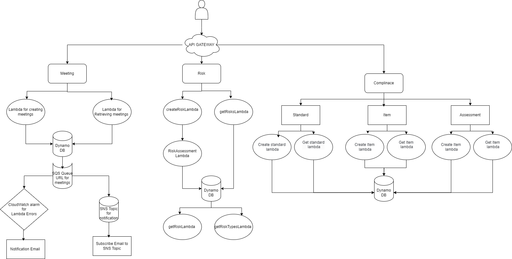

# GRC Dashboard

## Overview

The GRC (Governance, Risk, and Compliance) Dashboard is a web application designed to manage meetings, risks, compliance standards, items, and assessments. This application utilizes AWS services such as Lambda, API Gateway, DynamoDB, SQS, and SNS to provide a scalable and efficient backend infrastructure. 

### Features

- **Meeting Management**: Create and retrieve meetings using Lambda functions.
- **Risk Management**: Create and retrieve risks, perform risk assessments, and manage associated data.
- **Compliance Tracking**: Create compliance standards and items, manage assessments, and track compliance status.
- **Notifications**: Receive alerts and notifications via email for Lambda errors using SNS and CloudWatch.

## Architecture Explanation

The architecture of the GRC Dashboard is designed to efficiently manage governance, risk, and compliance processes. It leverages several AWS services to ensure scalability, reliability, and performance. The architecture is divided into three main components: Meetings, Risks, and Compliance. Each component interacts with dedicated AWS Lambda functions and utilizes DynamoDB for persistent data storage.

### 1. Meetings Management

- **Components**:
  - **API Gateway**: Acts as the entry point for all meeting-related requests. It routes incoming requests to the appropriate Lambda functions.
  - **CreateMeetingLambda**: Handles the creation of meetings. This function takes input data (such as meeting details) and stores it in the DynamoDB table. After successfully creating a meeting, it triggers an SNS notification to send an email to the participants or relevant stakeholders.
  - **GetMeetingsLambda**: Retrieves a list of meetings from the DynamoDB table.

- **Data Storage**:
  - **DynamoDB (Meeting Table)**: Stores meeting data, allowing for quick retrieval and updates. It is designed to scale with the number of meetings.

- **Error Handling**:
  - **CloudWatch Alarms**: Monitors Lambda function errors. If a threshold is breached, an SNS topic sends notifications (e.g., via email) to inform the team about the issue.

### 2. Risk Management

- **Components**:
  - **API Gateway**: Directs requests related to risks to the appropriate Lambda functions.
  - **CreateRiskLambda**: Facilitates the creation of new risks in the system. It gathers input data, assesses risk levels, and stores the data in DynamoDB.
  - **GetRisksLambda**: Retrieves existing risks from the DynamoDB table.
  - **RiskAssessmentLambda**: Calculates the risk assessment based on the provided data, such as impact and likelihood, and can be triggered when a new risk is created.

- **Data Storage**:
  - **DynamoDB (Risks Table)**: Holds risk data, including assessments and types, ensuring efficient data retrieval and management.

### 3. Compliance Tracking

- **Components**:
  - **API Gateway**: Routes requests concerning compliance standards, items, and assessments.
  - **Compliance Standard Lambda Functions**: Separate functions for creating and retrieving compliance standards, which are linked to relevant items and assessments.
  - **Compliance Item Lambda Functions**: Manage compliance items, allowing users to create and retrieve items associated with compliance standards.
  - **ConductAssessmentLambda**: Manages the assessment of compliance items, generating reports based on predefined criteria.

- **Data Storage**:
  - **DynamoDB (Compliance Tables)**: Three separate tables for standards, items, and assessments, each designed to efficiently store and retrieve compliance-related data.

### 4. Additional Features

- **SQS (Simple Queue Service)**: Integrated for managing asynchronous tasks, such as notifications or processing longer-running tasks without impacting the performance of Lambda functions.

- **SNS (Simple Notification Service)**: Used for sending notifications related to meeting setups and other significant events in the application. It sends emails to the designated recipients when a meeting is successfully created.

- **Monitoring and Notifications**:
  - **CloudWatch**: Provides monitoring and alarm functionality, allowing for proactive management of application health and performance.

### Architecture Flow

1. **User Interaction**: Users interact with the frontend application, which sends requests to the API Gateway.
2. **API Gateway Routing**: The API Gateway routes requests to the corresponding Lambda functions based on the resource and method (e.g., GET, POST).
3. **Lambda Execution**: The Lambda functions process the requests, perform necessary actions (like creating or retrieving data), and interact with DynamoDB to read or write data.
4. **Data Management**: Data is stored in DynamoDB tables, ensuring scalability and performance. Each component maintains its own table for organized data management.
5. **SNS Notification**: Upon successfully creating a meeting, the `CreateMeetingLambda` function triggers an SNS notification to send emails to relevant stakeholders.
6. **Error Handling**: If a Lambda function encounters an error, CloudWatch monitors these events, and SNS sends notifications to the designated recipients.

